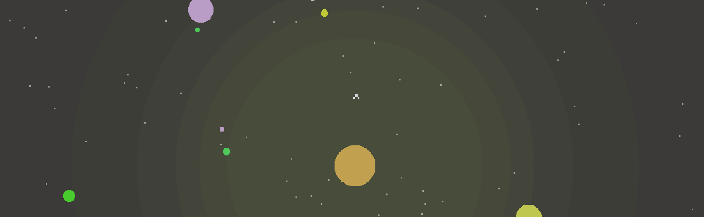

<p align="center">
  
</p>

# Planets

An exploration and resource management game. Mine planets, travel to different star systems, upgrade your ship and seek the Stellar Artifact.

## Getting started
```
npm start
```
### Prerequisites

```
Download and install npm with Node.js @ https://nodejs.org/en
```

### Installing

Select a folder, navigate to it, and clone this repository
with this command-line:

```
git clone https://github.com/digitsensitive/phaser3-typescript.git
```

Install the dependencies with this command-line:

```
npm install
```

### Building and Running

Perform a quick build (bundle.js) and start server:

```
npm start
```